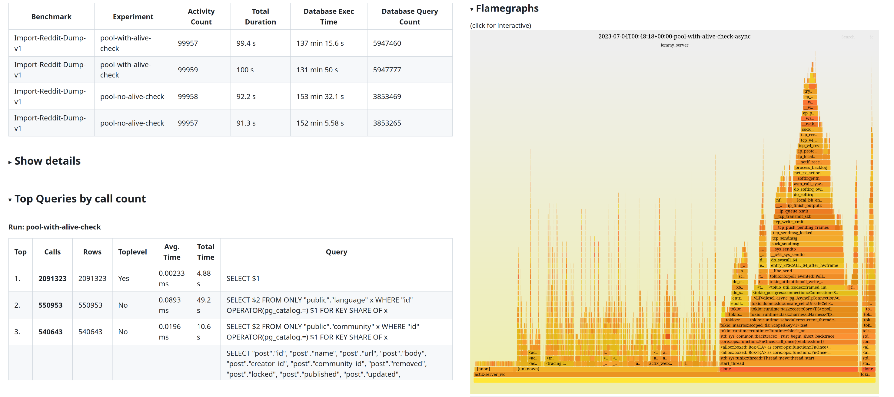

# Lemmy Benchmarking



Rust code that instruments lemmy server to check for performance.

Uses PostgreSQL pg_stat_statements to get query counts and [perf](https://perf.wiki.kernel.org/index.php/Main_Page) to build flame graphs.

Uses deno+react to render nice markdown/html files of the results. Results are uploaded to https://github.com/phiresky/lemmy-perf-data/tree/main/comparisons (currently manually).

## Implemented Benchmarks

### Import-Reddit-Dump

<p>
    The benchmark <code>Import-Reddit-Dump-v1</code> reads a real
    dump of reddit content from December 2022, limited to 100k events, and uploads it to a lemmy server
    as if reddit was another federated instance. The votes use the real counts
    but simulated users and times (uniformly randomly between 0 and 2h after
    the post/comment).
</p>

Todo:

- add warmup phase to improve comment/post vote/c, vote/p ratios.
- log memory usage while benchmarking (getrusage or wait3?)


### Todo: user-facing benchmark

Simulate user load (posting, commenting, upvoting)


## Notes

## how much activity is there actually?

```sql
with start as (select id, published from activity where id > (select max(id) from activity) - 100000 order by id limit 1) select now(), (select published as start from start), count(activity), sum(length(activity.data::text)) as bytes from activity where activity.id >= (select id from start);
```

lemmy.world:

```
              now              |           start            | count |  bytes
-------------------------------+----------------------------+-------+----------
 2023-07-06 12:50:31.136366+00 | 2023-07-06 11:16:00.563352 | 93709 | 80491448
 ```


that's around 50MB/hour (16.6 activities per second)

lemm.ee:

```
now,start,count,bytes
2023-07-06 11:38:24.840290 +00:00,2023-07-06 09:43:28.282779,96912,54744286
```
that's around 30MB/hour (14 activities per second)